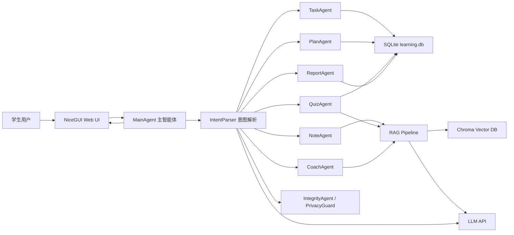
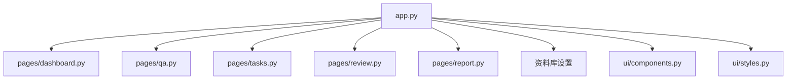
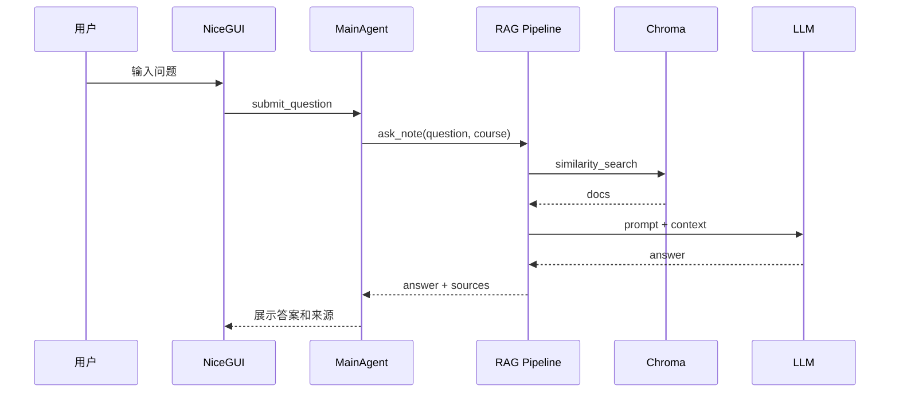
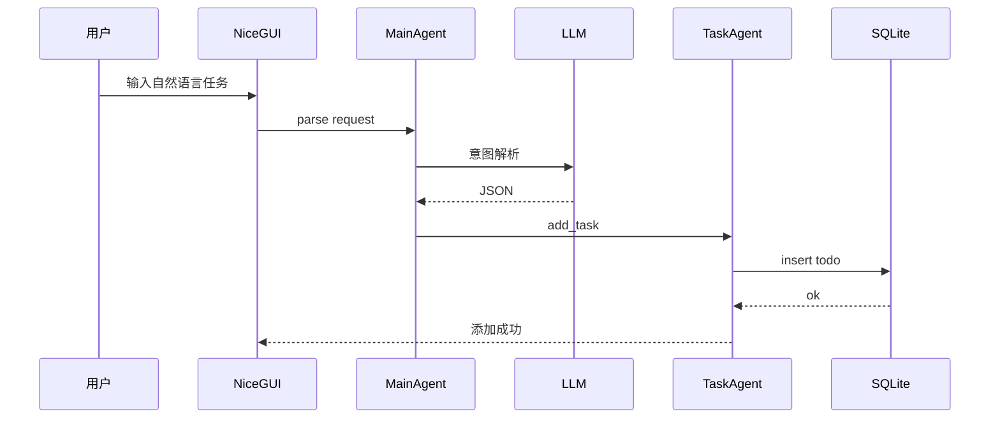

# StudyPilot 个人学习助手 HLD 高层设计文档

## 1. 文档定位

HLD 描述系统架构、模块划分和高层数据流，回答“系统整体怎么搭”。

## 2. 架构目标

- 支持 NiceGUI Web 界面。
- 支持 LLM 意图解析和多智能体路由。
- 支持 SQLite 结构化数据存储。
- 支持 Chroma 向量库和 RAG 问答。
- 支持学习计划、复习训练、错题、报告素材。
- 保持本地可运行、易演示、易维护。

## 3. 总体架构

## 4. 模块划分

| 模块 | 职责 |
| --- | --- |
| UI 层 | NiceGUI 页面、组件、用户交互 |
| Agent 层 | 任务、笔记、计划、复习、报告、安全等智能体 |
| 工具层 | 数据库工具、RAG 工具、隐私检查、健康检查 |
| 数据层 | SQLite、Chroma、Excel 数据源 |
| 模型层 | LLM API、Embedding API |

## 5. 页面架构

## 6. 数据架构

| 数据对象 | 存储 |
| --- | --- |
| 待办任务 | SQLite `todos` |
| 课程笔记 | SQLite `notes` |
| 笔记向量 | Chroma |
| 测验记录 | SQLite `quiz_records` |
| 错题 | SQLite `mistakes` |
| 掌握度 | SQLite `mastery` |
| 专注会话 | SQLite `study_sessions` |
| 实训日志 | SQLite `work_logs` |
| AI 使用记录 | SQLite `ai_usage_logs` |

## 7. 高层流程

### 7.1 RAG 问答

### 7.2 任务添加

## 8. 部署架构

本期以本地部署为主：

- 运行方式：`python src/app.py`
- 数据库：本地 `data/learning.db`
- 向量库：本地 `note_vector_db/`
- API Key：环境变量或 `.env`

可选部署：

- 局域网演示：NiceGUI `ui.run(host="0.0.0.0")`
- Gradio fallback：`python src/gradio_demo.py`

