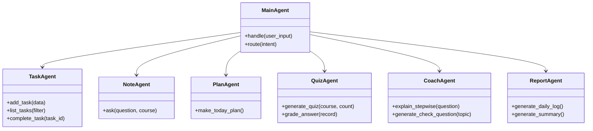

# StudyPilot 个人学习助手 LLD 低层设计文档

## 1. 文档定位

LLD 描述接口、数据结构、核心算法和模块内部设计，回答“具体怎么实现”。

## 2. 目录结构

```text
src/
  app.py
  init_db.py
  intent.py
  agents.py
  tools.py
  rag.py
  note_vector.py
  safety.py
  privacy.py
  report_agent.py
  pages/
  ui/
```

## 3. 数据表设计

### todos

| 字段 | 类型 | 约束 | 说明 |
| --- | --- | --- | --- |
| id | INTEGER | PRIMARY KEY | 任务 id |
| course | TEXT | NOT NULL | 课程 |
| task | TEXT | NOT NULL | 任务 |
| deadline | TEXT | 可空 | 截止日期 |
| status | TEXT | 默认未完成 | 状态 |
| priority | TEXT | 可空 | 高/中/低 |
| created_at | TEXT | 默认当前时间 | 创建时间 |

### notes

| 字段 | 类型 | 约束 | 说明 |
| --- | --- | --- | --- |
| id | INTEGER | PRIMARY KEY | 笔记 id |
| course | TEXT | NOT NULL | 课程 |
| title | TEXT | NOT NULL | 标题 |
| content | TEXT | NOT NULL | 内容 |
| tags | TEXT | 可空 | 标签 |

### quiz_records

| 字段 | 类型 | 说明 |
| --- | --- | --- |
| id | INTEGER | 记录 id |
| course | TEXT | 课程 |
| question | TEXT | 题目 |
| answer | TEXT | 标准答案 |
| user_answer | TEXT | 用户答案 |
| is_correct | INTEGER | 1/0 |
| note_id | INTEGER | 来源笔记 |
| chunk_id | TEXT | 来源分块 |

## 4. 核心数据结构

### IntentResult

```json
{
  "intent": "add_todo",
  "course": "Python",
  "task": "完成列表推导式作业",
  "deadline": "周五",
  "priority": "高",
  "academic_integrity_risk": "low"
}
```

### RagAnswer

```json
{
  "answer": "列表推导式是一种快速生成列表的语法...",
  "confidence": "高可信",
  "sources": [
    {
      "note_id": 1,
      "course": "Python",
      "title": "列表推导式",
      "snippet": "[x*2 for x in range(10)]",
      "score": 0.86
    }
  ]
}
```

## 5. 核心函数设计

### parse_intent(user_input)

职责：调用 LLM，将用户自然语言转换为结构化 JSON。

伪代码：

```python
def parse_intent(user_input: str) -> dict:
    prompt = INTENT_PROMPT.format(user_input=user_input)
    response = llm_json(prompt)
    data = validate_intent(response)
    return data
```

异常：

- JSON 解析失败：返回 `unknown`。
- 缺字段：填默认值或要求用户补充。

### ask_note(question, course=None)

职责：执行 RAG 检索和回答生成。

伪代码：

```python
def ask_note(question: str, course: str | None = None) -> RagAnswer:
    query = rewrite_query(question)
    docs = vector_db.similarity_search(query, filter={"course": course}, k=3)
    confidence = compute_confidence(docs)
    if confidence == "来源不足":
        return no_source_response(question)
    answer = generate_answer(question, docs)
    return RagAnswer(answer=answer, sources=docs, confidence=confidence)
```

### make_plan(date)

职责：根据任务、错题和掌握度生成学习计划。

优先级算法：

```text
priority_score = deadline_score * 0.5 + mastery_gap * 0.3 + overdue_score * 0.2
```

### generate_quiz(course, count, question_type)

职责：基于笔记生成复习题。

规则：

- 题目必须来自检索到的笔记片段。
- 每题保存 note_id/chunk_id。
- 答题后写入 quiz_records。

### check_project_health()

职责：检查演示环境是否可用。

检查项：

- 数据库是否存在。
- 表是否存在。
- Chroma 是否可检索。
- API Key 是否存在。
- 依赖是否可导入。

## 6. 类设计



## 7. 错误处理

| 错误 | 处理 |
| --- | --- |
| LLM 超时 | 返回重试提示，保留用户输入 |
| 向量库为空 | 提示先导入笔记并重建索引 |
| 来源不足 | 不生成强结论，提示补充笔记 |
| 数据库写入失败 | 返回错误并记录日志 |
| 高风险代写请求 | 切换为学习辅助模式 |

