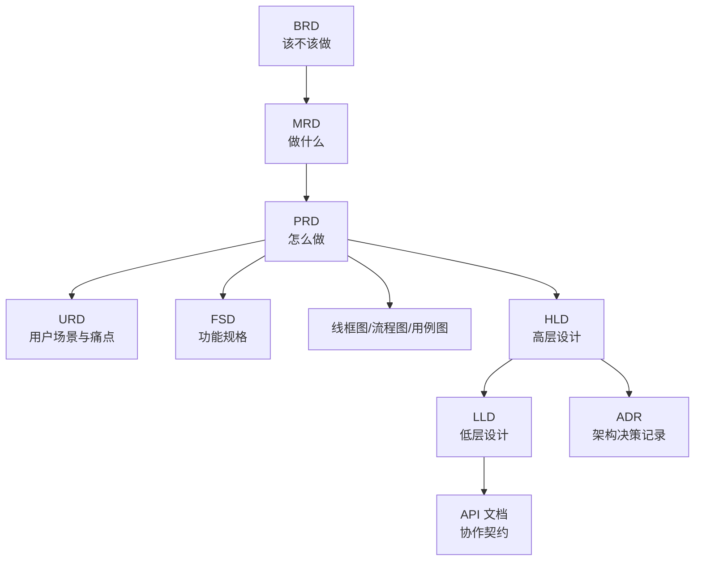

# StudyPilot 项目设计文档索引

## 1. 文档关系

## 2. 文档清单

| 文档 | 作用 | 文件 |
| --- | --- | --- |
| BRD | 判断项目该不该做，说明业务价值和成功标准 | `BRD_业务需求文档.md` |
| MRD | 分析市场、竞品、目标用户和产品机会 | `MRD_市场需求文档.md` |
| PRD | 定义产品定位、需求范围、UI、架构和实施计划 | `个人学习助手_PRD与技术架构.md` |
| URD | 聚焦用户场景、痛点和用户故事 | `URD_用户需求文档.md` |
| FSD | 细化每个功能的输入、输出、步骤和异常 | `FSD_功能规格说明书.md` |
| 设计输出 | 线框图、业务流程图、用例图、状态图 | `设计输出_线框图_流程图_用例图.md` |
| HLD | 系统架构、模块划分、高层流程 | `HLD_高层设计文档.md` |
| LLD | 数据结构、函数、类、算法和错误处理 | `LLD_低层设计文档.md` |
| API | 前后端/模块协作契约 | `API_接口文档.md` |
| ADR | 记录技术选型和架构决策依据 | `ADR_架构决策记录.md` |

## 3. 推荐阅读顺序

1. `BRD_业务需求文档.md`
2. `MRD_市场需求文档.md`
3. `个人学习助手_PRD与技术架构.md`
4. `URD_用户需求文档.md`
5. `设计输出_线框图_流程图_用例图.md`
6. `FSD_功能规格说明书.md`
7. `HLD_高层设计文档.md`
8. `LLD_低层设计文档.md`
9. `API_接口文档.md`
10. `ADR_架构决策记录.md`

## 4. 一句话区分

- BRD：这个项目为什么值得做。
- MRD：市场和用户需要我们做什么。
- PRD：产品具体要怎么设计。
- URD：用户在什么场景下为什么需要它。
- FSD：每个功能具体怎么操作和验收。
- HLD：系统由哪些大模块组成。
- LLD：模块内部怎么实现。
- API：模块之间怎么传数据。
- ADR：为什么选择这些技术方案。

