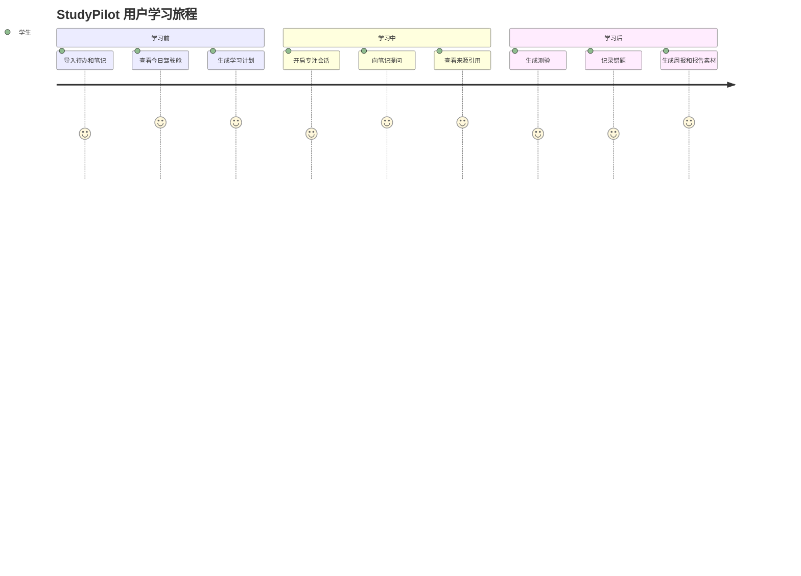

# StudyPilot 个人学习助手 URD 用户需求文档

## 1. 文档定位

URD 聚焦用户场景、痛点和真实需求，回答“用户到底需要什么”。

## 2. 用户角色

| 角色 | 描述 | 核心目标 |
| --- | --- | --- |
| 实训学生 | 正在完成 AI 应用开发课程实训 | 做出可演示项目并完成报告 |
| 日常学习学生 | 同时学习多门课程 | 管理任务、复习笔记、提升效率 |
| 考前复习学生 | 面临考试或作业截止 | 快速抓重点、练习和查漏补缺 |
| 指导教师/评委 | 查看项目成果 | 判断项目是否完整、真实、有创新 |

## 3. 用户痛点

| 编号 | 痛点 | 用户影响 |
| --- | --- | --- |
| P1 | 作业、笔记、复习资料分散 | 不知道今天先做什么 |
| P2 | 通用 AI 回答不贴合课堂笔记 | 复习时难以对齐老师讲法 |
| P3 | AI 可能幻觉或假引用 | 误学错误知识 |
| P4 | 直接看 AI 答案导致假掌握 | 自己做题仍不会 |
| P5 | 笔记太多不会复习 | 考前效率低 |
| P6 | 错题与原笔记割裂 | 做错后不知道回哪里复习 |
| P7 | deadline 多导致焦虑 | 拖延和计划失控 |
| P8 | 最后实训报告难写 | 忘记过程和截图 |
| P9 | 隐私和 API Key 风险 | 不敢上传真实资料 |

## 4. 用户场景

### 场景一：添加课程任务

用户输入：“周五前完成 Python 列表推导式作业”。系统自动识别课程、任务和截止日期，写入待办，并提示该任务是否紧急。

### 场景二：基于笔记问答

用户问：“RAG 的流程是什么？”系统检索个人笔记，回答概念、步骤和例子，并展示来源笔记标题与片段。

### 场景三：生成今日计划

用户点击“生成今日计划”。系统综合未完成任务、deadline、错题和掌握度，生成上午/下午/晚上计划。

### 场景四：复习训练

用户选择 Python 笔记，点击“生成测验”。系统生成 5 道题，答错后自动记录错题并链接原始笔记片段。

### 场景五：专注学习会话

用户选择一个任务，开启 25 分钟专注模式。结束后填写完成情况和卡点，系统写入学习日志。

### 场景六：实训报告辅助

用户进入“报告素材”页面，系统根据学习日志生成每日工作记录、问题反思、核心代码说明和截图清单。

## 5. 用户故事

| 编号 | 用户故事 | 验收标准 |
| --- | --- | --- |
| US-01 | 作为学生，我希望用自然语言添加任务，以便不用手动填表 | 输入任务后 todos 表新增记录 |
| US-02 | 作为学生，我希望 AI 回答基于我的笔记，以便复习更贴合课堂 | 回答展示来源笔记 |
| US-03 | 作为学生，我希望知道 AI 回答是否可信，以便避免误学 | 显示可信度标签 |
| US-04 | 作为学生，我希望从笔记生成测验，以便检查掌握程度 | 生成题目、答案和解析 |
| US-05 | 作为学生，我希望错题能回到原笔记，以便定位薄弱点 | 错题记录包含 note_id/chunk_id |
| US-06 | 作为学生，我希望系统帮我安排今天计划，以便减少拖延 | 输出分时段计划 |
| US-07 | 作为学生，我希望有截图检查清单，以便报告不漏项 | 显示缺失截图项 |
| US-08 | 作为学生，我希望 API Key 不泄露，以便安全使用 | API Key 只从环境变量读取 |

## 6. 用户旅程

## 7. 用户需求优先级

| 优先级 | 需求 |
| --- | --- |
| P0 | 数据导入、任务管理、RAG 问答、来源引用、学习计划 |
| P1 | 闪卡测验、错题本、专注模式、报告素材、项目健康检查 |
| P2 | Prompt 教练、隐私清理、知识地图、考前冲刺 |
| P3 | 多人协作、教师反馈、移动端同步 |

