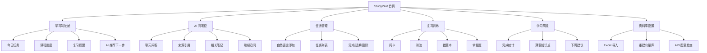
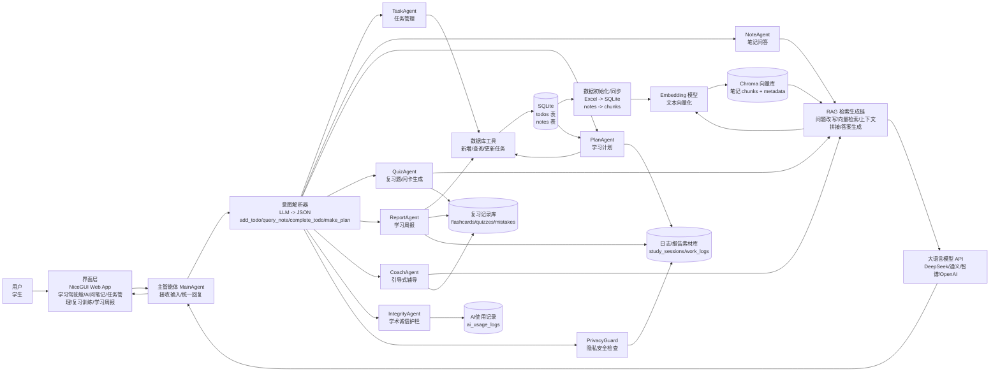

# 个人学习助手 PRD 与技术架构设计

## 1. 项目背景

本项目选自《人工智能应用开发技术实训指导书》第三部分“案例B——个人学习助手”。指导书要求开发一个能管理学习任务、整理笔记、回答知识点问题的个人学习助手，并在 5 天实训周期内完成数据准备、自然语言指令解析、笔记 RAG、多智能体协作和 Gradio 界面/部署。

与普通待办工具不同，本项目的核心价值是把“学习任务、课程笔记、知识问答、复习计划”连接成一个闭环：学生可以用自然语言添加任务、查询笔记、询问知识点、生成今日学习计划，并通过个人笔记 RAG 保证回答来源于自己的学习资料，而不是泛泛地回答。

## 2. 竞品与启发

| 产品 | 主要能力 | UI/体验特点 | 对本项目的启发 |
| --- | --- | --- | --- |
| Google NotebookLM | 基于用户上传资料进行摘要、问答、引用和知识连接 | 左侧资料源、中间问答/笔记、右侧学习产物，强调“来源可见” | 建立“资料库 + 问答 + 来源引用”三栏逻辑，回答必须能回到个人笔记 |
| Quizlet | 闪卡、学习模式、测试、AI 学习工具 | 以学习集为中心，功能入口清楚，练习反馈直接 | 增加“闪卡/测验/错题复习”，让项目不只是聊天 |
| Knowt | 课堂录音、PDF 摘要、闪卡、测验、游戏化练习、语音辅导 | 面向学生的年轻化卡片布局，功能入口像学习工具箱 | 增加“资料导入后自动生成学习材料”的流程，如摘要、闪卡、测验 |
| StudyFetch | AI tutor、学习计划、自动笔记、练习题、语音/可视化讲解、游戏化挑战 | 强调学习材料、截止日期和个性化计划，学习路径清楚 | 增加“里程碑式学习计划”和“AI tutor 引导式讲解” |
| Mindgrasp | 上传资料后生成笔记、摘要、闪卡、测验和 24/7 AI tutor | 每个学习 session 有进度追踪和检查清单 | 增加“学习会话 Study Session”，每门课/每章有进度 |
| Khanmigo | AI tutor 与教学助手，引导学生自己思考 | 不直接给答案，使用提示、追问、逐步引导 | 增加“苏格拉底式辅导模式”，避免只给最终答案 |
| ChatGPT Study Mode | 分步指导、知识检查、个性化支持、自我反思提示 | 对话中可切换学习模式，回答结构清晰 | 在问答结果后加入“我来考你一下”和“下一步建议” |
| Anki | 间隔重复、记忆卡片、复习队列 | 功能朴素但复习效率高，重点是记忆调度 | 增加“今日复习队列”和掌握度字段 |
| Notion AI | 笔记整理、摘要、行动项提取 | 信息块组织清晰，适合长期沉淀 | 增加“从笔记提取待办/重点/关键词”的自动整理能力 |

本项目的产品形态应从“聊天助手”升级为“个人学习驾驶舱”。MVP 仍然保持实训可完成，但扩展设计要覆盖资料管理、RAG 问答、任务计划、主动复习、错题追踪和学习进度可视化。这样既满足评分标准，也能在答辩时体现真实产品思维。

## 3. 产品定位

产品名称：StudyPilot 个人学习助手

一句话定位：一个基于个人课程笔记和学习任务的 AI 学习管理助手，帮助学生“问得准、记得牢、做得完”。

目标用户：人工智能应用开发技术实训学生，以及需要同时管理多门课程、作业、笔记和复习计划的高职/大学生。

使用场景：

- 课后把课程笔记录入系统，后续可直接询问“什么是列表推导式”“RAG 的流程是什么”。
- 收到作业任务后，用自然语言输入“周五前完成 Python 列表推导式作业”，系统自动识别课程、任务和截止日期。
- 每天打开助手，输入“帮我安排今天的学习计划”，系统根据未完成任务、截止日期和笔记薄弱点生成计划。
- 复习前输入“根据我的机器学习笔记生成 5 道自测题”，系统生成练习题并给出答案解析。

## 4. 产品目标

### 4.1 实训目标

- 完成个人学习数据模型设计，包含待办表和笔记表。
- 实现自然语言意图解析，支持添加待办、完成待办、查询笔记、生成计划等操作。
- 构建个人笔记向量库，实现基于笔记的 RAG 问答。
- 实现至少 3 个协作 Agent：任务管理 Agent、笔记问答 Agent、学习计划 Agent。
- 使用 Gradio 搭建可演示 Web 界面，并支持本地运行或打包。

### 4.2 产品目标

- 让学习信息从“分散记录”变成“可检索、可问答、可规划”的智能学习数据。
- 提高学生完成任务和复习笔记的效率。
- 让 AI 回答尽量可溯源，降低大模型凭空编造的风险。
- 在 5 天实训内形成可展示、可解释、可评分的完整应用。

## 5. 用户画像

| 用户 | 特征 | 痛点 | 期望 |
| --- | --- | --- | --- |
| 实训学生 | 同时学习 Python、AI 应用开发、英语等课程 | 作业和笔记分散，容易忘记截止日期 | 快速管理任务、查询笔记、生成计划 |
| 复习型学生 | 考前集中复习 | 不知道重点在哪，笔记太长 | 自动摘要重点、生成自测题 |
| 项目答辩学生 | 需要展示 AI 应用开发能力 | 功能若太简单，创新不足 | 有 RAG、Agent、工具调用和清晰架构 |

### 5.1 市场调研发现的学生痛点

公开调研和教育机构文章显示，学生使用 AI 学习工具时并不只是需要“更快得到答案”，还会遇到准确性、学习深度、诚信边界、隐私和学习自控等问题。

| 痛点 | 市场/调研现象 | 对学生的影响 | StudyPilot 应对方向 |
| --- | --- | --- | --- |
| AI 幻觉与假引用 | 学生使用 AI 时常遇到错误信息、虚假引用、过度自信但误导性的回答 | 学生可能把错误答案写进作业或报告 | 强制来源引用、答案可信度提示、无来源不回答 |
| 不知道什么时候可以用 AI | 调研显示学生更能接受用 AI 做资料研究，但对写作业、解数学题等用途存在明显分歧 | 学生容易在“辅助学习”和“代写代做”之间踩线 | 增加 AI 使用边界提示和学术诚信模式 |
| 过度依赖 AI，形成“假掌握” | 多项教育讨论担心学生直接拿 AI 答案，会削弱批判性思维和主动学习 | 学生看懂答案但不会独立完成题目 | 引导式 Tutor、先提示后答案、知识检查、反思问题 |
| AI 素养不足 | 有学生高频使用 AI，但并不觉得自己具备足够 AI 知识和技能 | 不会写好提示词，也不会验证输出质量 | 内置 Prompt 教练和“如何追问”建议 |
| 隐私与数据安全 | 教育 AI 工具常涉及上传笔记、作业和个人学习数据 | 学生担心课程资料、作业内容、个人表现被泄露 | 本地 SQLite/Chroma 存储、敏感信息提示、API Key 安全配置 |
| 工具割裂 | 学生可能同时用待办、笔记、网盘、ChatGPT、背单词软件 | 信息分散，复习计划和任务执行断开 | 统一学习驾驶舱，把任务、笔记、问答、复习、周报打通 |
| 笔记很多但不会复习 | AI 能总结资料，但学生仍不知道哪些内容该优先复习 | 考前复习无重点，时间分配低效 | 薄弱知识点、错题本、掌握度和今日复习队列 |
| 拖延和计划失控 | 学生常把 deadline 记下来，但缺少每日行动拆解 | 临近截止日期才赶作业，学习压力变大 | Deadline 风险预警、番茄钟学习会话、任务拆解 |
| 回答太泛，不贴合个人课程 | 通用 AI 对课程背景不了解，答案可能正确但不符合老师讲法 | 复习时难以对齐课堂内容 | 课程专属 RAG、按课程/笔记范围回答 |
| 学习过程不可见 | 很多工具只给结果，不记录思考和练习过程 | 答辩或复盘时难以证明自己做了什么 | 学习日志、操作记录、实训报告素材生成 |
| 注意力被打断 | AI 工具入口多、推荐多，容易从学习变成刷工具 | 学习效率下降 | 专注模式、单任务学习会话、结束后复盘 |
| 缺少情绪和压力支持 | 学生面对多个截止日期时容易焦虑 | 计划无法坚持，挫败感增强 | 温和提醒、压力分级、任务减负建议 |

## 6. 需求范围

### 6.1 MVP 必做功能

| 模块 | 功能 | 说明 | 优先级 |
| --- | --- | --- | --- |
| 数据管理 | 导入待办 Excel | 从 `todo.xlsx` 导入 `todos` 表 | P0 |
| 数据管理 | 导入笔记 Excel | 从 `notes.xlsx` 导入 `notes` 表 | P0 |
| 任务管理 | 添加待办 | 自然语言或表单添加任务 | P0 |
| 任务管理 | 查询未完成任务 | 按课程、截止日期、状态筛选 | P0 |
| 任务管理 | 完成待办 | 根据任务 id 或任务关键词更新状态 | P0 |
| 意图解析 | 自然语言转 JSON | 识别 `add_todo`、`query_note`、`complete_todo`、`make_plan` | P0 |
| RAG 问答 | 笔记向量化 | 使用 Embedding 模型生成向量并存入 Chroma | P0 |
| RAG 问答 | 基于笔记回答 | 检索 Top-K 笔记片段，拼接上下文后生成回答 | P0 |
| Agent | TaskAgent | 管理学习任务 | P0 |
| Agent | NoteAgent | 调用 RAG 回答笔记问题 | P0 |
| Agent | PlanAgent | 根据待办和学习情况生成今日计划 | P0 |
| 界面 | Gradio 聊天界面 | 支持自然语言交互 | P0 |
| 部署 | 本地运行/打包 | 支持 `python src/app.py` 或 PyInstaller 打包 | P1 |

### 6.2 创新功能

| 功能 | 说明 | 价值 | 优先级 |
| --- | --- | --- | --- |
| 来源引用 | 回答后显示命中的课程、笔记标题和相似度 | 提升可信度，体现 RAG 优势 | P1 |
| 自动复习题 | 根据指定课程笔记生成选择题/简答题 | 对标 Quizlet，增强学习闭环 | P1 |
| 今日计划评分 | 根据截止日期、任务数量和预计耗时生成优先级 | 让计划更像“学习教练” | P1 |
| 学习周报导出 | 汇总已完成任务、未完成任务、复习建议 | 可作为报告截图/创新加分 | P2 |
| 语音输入 | 使用浏览器或扩展库进行语音转文字 | 展示交互创新 | P2 |

### 6.3 扩展功能地图

为了让项目功能更丰富，建议按“能否在 5 天内落地”分为三层。

#### 第一层：实训增强版，建议优先实现

| 模块 | 功能 | 说明 | 价值 |
| --- | --- | --- | --- |
| 学习驾驶舱 | 今日学习概览 | 展示今日待办、逾期任务、已完成数量、推荐复习课程 | 打开应用即知道今天做什么 |
| 学习驾驶舱 | 学习进度条 | 按课程统计任务完成率、笔记数量、复习题完成数 | 让结果可视化，方便截图 |
| 笔记库 | 课程资料卡片 | 每门课显示笔记数、最近更新、可提问问题 | 类似 NotebookLM 的资料源概念 |
| RAG 问答 | 来源引用卡片 | 回答后列出命中的笔记标题、课程、片段 | 提升可信度 |
| 任务计划 | 智能优先级 | 根据 deadline、status、课程权重自动标记高/中/低 | 比普通待办更智能 |
| 复习训练 | 自动生成闪卡 | 从笔记中生成“问题-答案”卡片 | 对标 Quizlet/Anki |
| 复习训练 | 自动生成测验 | 生成选择题、判断题、简答题并给答案解析 | 增加可演示功能 |
| 学习计划 | 今日三段式计划 | 自动分为上午、下午、晚上，每段绑定任务 | 答辩展示直观 |

#### 第二层：创新展示版，有时间再做

| 模块 | 功能 | 说明 | 价值 |
| --- | --- | --- | --- |
| Tutor 模式 | 引导式讲解 | 遇到概念问题时先提示，再逐步讲解，不直接给最终答案 | 对标 Khanmigo/ChatGPT Study Mode |
| 错题本 | 错题记录 | 用户做错测验后自动记录知识点、原题、正确答案 | 形成复习闭环 |
| 掌握度 | 知识点掌握评分 | 每个知识点记录“未学/熟悉/掌握/需复习” | 支持个性化计划 |
| 周报 | 学习周报导出 | 输出本周完成任务、薄弱课程、下周建议 | 可导出 Markdown/PDF |
| 资料导入 | PDF/Markdown 导入 | 除 Excel 外支持上传 PDF 或 Markdown 笔记 | 更像真实产品 |
| 语音学习 | 语音提问/朗读摘要 | 用语音输入问题，或朗读知识点摘要 | 增加交互亮点 |

#### 第三层：长期产品版，仅写入 PRD

| 模块 | 功能 | 说明 |
| --- | --- | --- |
| 学习日历 | 按日期展示任务、复习计划和考试节点 |
| 多端同步 | Web、移动端同步学习记录 |
| 班级共享 | 同学之间共享公开笔记和题库 |
| 学习成就 | 连续学习天数、完成徽章、课程等级 |
| 个性化模型 | 根据用户做题历史调整讲解难度 |
| 插件工具 | 接入搜索、翻译、代码运行、公式解释等工具 |

### 6.4 推荐最终功能组合

在本次实训中，推荐最终展示 6 个核心入口：

1. 学习驾驶舱：今日任务、课程进度、复习提醒。
2. AI 问笔记：基于个人笔记 RAG 回答，并显示来源引用。
3. 任务管理：自然语言添加/完成/查询待办。
4. 智能计划：根据 deadline 自动生成今日学习计划。
5. 复习训练：从笔记生成闪卡和测验。
6. 学习周报：汇总完成情况和薄弱知识点。

这样项目既不会超出实训难度，又比基础案例更完整、更像一个真实 AI 学习产品。

### 6.5 基于竞品的差异化功能升级

竞品大多集中在“上传资料 -> 生成摘要/闪卡/测验”或“AI tutor 问答”两类能力上。StudyPilot 的优势不应该只是复制这些功能，而是把学习任务、个人笔记、复习训练、课程 deadline 和实训报告连接成一个本地化闭环。

| 差异化方向 | 竞品常见做法 | StudyPilot 升级设计 | 为什么更有优势 |
| --- | --- | --- | --- |
| 任务 + 笔记联动 | 多数产品偏资料问答或闪卡，任务管理较弱 | 每条待办可绑定课程笔记、知识点和复习题 | 不只是“学资料”，还能推动学生按 deadline 完成任务 |
| Deadline 驱动复习 | 闪卡产品通常按记忆曲线复习 | 同时考虑截止日期、任务优先级、掌握度和错题 | 更贴近学生真实作业/考试压力 |
| 可解释 RAG | NotebookLM 等强调来源引用 | 回答展示来源笔记、课程、命中片段、可信度，并提示“未找到来源时不乱答” | 适合课程实训展示 RAG 价值 |
| 学习驾驶舱 | 竞品常按资料库或学习集组织 | 首页直接展示今日任务、逾期风险、薄弱知识点、AI 推荐下一步 | 打开应用就能行动，产品完整感更强 |
| 本地隐私学习库 | 多数竞品依赖云端账号和上传资料 | SQLite + Chroma 本地运行，API Key 环境变量管理 | 适合学生实训和个人笔记隐私 |
| 实训报告助手 | 竞品通常不关注课程报告 | 自动生成“每日工作记录、问题反思、项目总结、截图清单”草稿 | 直接服务本课程交付物，差异化明显 |
| 错题 -> 笔记反查 | 竞品能记录错题，但不一定回到原笔记 | 每道错题关联原始笔记片段，点击可追溯知识来源 | 让复习不是孤立刷题，而是回到知识依据 |
| Tutor 防抄袭模式 | 普通聊天会直接给答案 | CoachAgent 使用提示、追问、分步讲解、知识检查 | 更像学习导师，减少“只拿答案不学习” |
| 课程知识地图 | 竞品多展示学习集列表 | 从笔记标题、标签、错题生成课程知识点图谱 | 答辩展示效果强，也能帮助复习规划 |
| 代码学习工具 | 通用学习产品未必适配 AI/Python 实训 | 针对 Python/AI 应用开发增加代码解释、报错分析、核心函数讲解 | 与人工智能应用开发技术课程强相关 |

#### 建议新增的优势功能

1. 智能学习驾驶舱 Pro  
   将 `todos`、`notes`、`quiz_records`、`mistakes` 汇总成首页仪表盘，展示今日任务、逾期风险、课程进度、薄弱知识点和 AI 推荐。

2. 证据链问答 Evidence-based QA  
   每次回答都给出“答案、依据、来源笔记、可信度、可继续追问问题”。如果检索不到笔记，系统提示“当前个人笔记中没有找到依据”，并建议用户补充笔记。

3. Deadline + 掌握度双因子计划  
   学习计划不只按截止日期排序，还结合掌握度和错题数。例如“英语 deadline 不紧但错题多，建议安排 20 分钟复习”。

4. 自动错题本与知识点回填  
   测验答错后，系统自动记录错题，标记相关知识点为“需复习”，并把错题关联到原始笔记片段。

5. 实训报告生成器  
   根据系统日志自动生成实训报告素材，包括每日完成内容、关键代码说明、遇到的问题、解决方法、运行截图清单和项目总结草稿。

6. 课程知识地图  
   从笔记标题、标签、RAG metadata 和错题记录生成课程知识点网络，如 `RAG -> 向量化 -> Chroma -> 相似度检索 -> Prompt 生成`。

7. AI 学习契约  
   用户每天设置学习目标，系统在结束时检查完成情况，生成“今日复盘”：完成了什么、哪里卡住、明天先做什么。

8. 分层讲解模式  
   每个知识点提供“30 秒解释、详细解释、例题讲解、考前速记”四种输出，让不同复习场景都能使用。

#### 差异化版本定位

基础竞品多强调“资料生成学习材料”，StudyPilot 的差异化定位可以写成：

> StudyPilot 不是单纯的 AI 问答工具，而是面向课程实训学生的本地化学习操作系统。它把个人笔记、课程任务、截止日期、错题、复习计划和实训报告连接起来，用 RAG 保证回答有依据，用 Agent 自动安排学习行动，用可视化驾驶舱帮助学生每天知道下一步该做什么。

### 6.6 痛点驱动新增功能

以下功能不是简单堆功能，而是从学生使用 AI 学习助手时的真实痛点反推出来的解决方案。实训时建议选择其中 3-5 个重点实现，其他作为 PRD 扩展规划。

#### 功能一：来源可信度雷达

解决痛点：AI 幻觉、假引用、回答太泛。

功能说明：

- 每次 RAG 回答后展示来源笔记标题、课程、命中片段、相似度。
- 对答案给出可信度标签：`高可信`、`部分可信`、`未找到充分依据`。
- 当检索不到个人笔记时，系统不直接编造，而是提示：“你的笔记库中没有找到依据，是否使用通用知识回答并标记为非笔记来源？”
- 支持“一键查看原笔记”，让学生回到知识来源。

实现方式：

- RAG 检索返回 Top-K 文档和 similarity score。
- 设置阈值，例如最高相似度低于 0.35 时提示来源不足。
- 回答对象增加 `sources` 和 `confidence` 字段。

#### 功能二：AI 学术诚信护栏

解决痛点：不知道什么时候可以用 AI，容易从辅助学习变成代写代做。

功能说明：

- 在用户输入“帮我写完整报告/直接给作业答案/替我完成论文”时，系统切换为学习辅助模式。
- 提供“思路、提纲、检查清单、示例片段”，但不直接生成可提交的完整作业。
- 在报告生成器中自动加入“AI 辅助说明”，说明哪些内容由 AI 辅助整理，哪些由学生完成。
- 每个功能标注用途：`允许：解释/总结/出题/检查`，`谨慎：整篇代写/直接给答案`。

实现方式：

- 增加 `IntegrityAgent`，识别高风险请求。
- 意图解析增加 `academic_integrity_risk` 字段。
- 对高风险请求使用专门 prompt：先引导、再给框架、最后要求用户自己补充。

#### 功能三：反依赖 Tutor 模式

解决痛点：过度依赖 AI、假掌握、批判性思维下降。

功能说明：

- 对概念类问题不直接只给答案，而是采用“提示 -> 追问 -> 解释 -> 小测”的结构。
- 用户可以选择讲解深度：`提示模式`、`详细讲解`、`考前速记`、`例题训练`。
- 回答末尾自动生成 1-2 个检查问题，例如：“你能用自己的话解释 RAG 中检索和生成的关系吗？”
- 如果用户连续答错，系统回到原笔记片段重新讲解。

实现方式：

- `CoachAgent` 负责分步讲解。
- `QuizAgent` 自动生成检查题。
- `mastery` 表记录每个知识点掌握状态。

#### 功能四：Prompt 教练

解决痛点：学生想用 AI，但不会提问、不会追问、不会验证。

功能说明：

- 当用户输入过短或模糊时，系统提示如何改写问题。
- 提供一键追问按钮：
  - “用例子解释”
  - “结合我的笔记”
  - “出 3 道题考我”
  - “列出易错点”
  - “用表格对比”
- 展示“好问题模板”，如“请基于 Python 笔记，用一个例子解释列表推导式，并指出常见错误”。

实现方式：

- 输入长度过短或缺少课程/主题时触发建议。
- 在 UI 右侧显示 prompt chips。
- 记录用户常用追问，作为个性化推荐。

#### 功能五：隐私安全模式

解决痛点：学生担心上传笔记、作业、个人学习数据造成泄露。

功能说明：

- 默认本地保存学习数据：SQLite 保存任务和记录，Chroma 保存笔记向量。
- API Key 只读取环境变量，不写入代码和报告。
- 上传/导入资料前提示用户不要放入身份证、手机号、家庭住址等敏感信息。
- 周报导出前提供“隐私清理”选项，自动隐藏姓名、学号、API Key。

实现方式：

- `PrivacyGuard` 工具扫描文本中的手机号、邮箱、密钥形态字符串。
- 导出报告前执行隐私检查。
- `.env` 和数据库加入 `.gitignore`。

#### 功能六：专注学习会话

解决痛点：任务拖延、注意力被打断、计划无法落地。

功能说明：

- 用户选择一个任务，开启 25 分钟专注学习会话。
- 会话开始前系统展示目标、关联笔记、建议步骤。
- 会话结束后系统要求用户填写“完成情况/卡点/下一步”，并写入学习日志。
- 若任务过大，系统自动拆成 3-5 个小步骤。

实现方式：

- 增加 `study_sessions` 表，记录 session_id、task_id、start_time、end_time、reflection。
- NiceGUI 页面显示倒计时和当前任务卡片。
- `PlanAgent` 根据 session 记录调整后续计划。

#### 功能七：错题回到原笔记

解决痛点：刷题和笔记割裂，做错后不知道复习哪一段。

功能说明：

- 每道测验题保存关联的 `note_id` 和 `chunk_id`。
- 用户答错后，错题本显示原始笔记片段和推荐复习问题。
- 系统自动降低相关知识点掌握度，并加入今日/明日复习队列。

实现方式：

- `quiz_records` 表记录 question、answer、user_answer、is_correct、note_id、chunk_id。
- `mistakes` 表记录错题、知识点、复习次数。
- RAG metadata 中保留 chunk_id。

#### 功能八：学习负荷与压力提示

解决痛点：多个 deadline 同时到来，学生焦虑但不知道如何取舍。

功能说明：

- Dashboard 展示本周任务负荷：轻松、正常、偏高、爆满。
- 当任务集中在同一天时，系统建议提前拆分。
- 输出计划时避免把一天排得过满，保留休息和缓冲时间。
- 对逾期任务给出补救方案，而不是只显示红色警告。

实现方式：

- 根据 deadline、预计耗时、未完成数量计算 `workload_score`。
- `PlanAgent` 生成计划时加入最大每日学习时长限制。
- UI 用颜色标签展示压力等级。

#### 功能九：课程知识地图

解决痛点：笔记很多但结构不清，学生不知道知识点之间的关系。

功能说明：

- 从笔记标题、标签、关键词和错题记录生成知识点图谱。
- 显示知识点之间的关系，例如：`RAG -> Embedding -> 向量库 -> 相似度检索 -> Prompt`。
- 点击知识点可以查看相关笔记、错题、复习题和掌握度。

实现方式：

- 先用简单关键词规则或 LLM 从笔记中抽取 key concepts。
- 用 Mermaid 或 NiceGUI 图表组件展示图谱。
- 后续可扩展为 network graph。

#### 功能十：实训过程日志与报告素材库

解决痛点：学生做了功能但忘记记录，最后写报告困难。

功能说明：

- 自动记录每天完成的功能、运行结果、遇到的问题和解决方法。
- 用户可以手动补充“今日反思”。
- 系统根据日志生成报告中的“每日工作记录”“问题与反思”“实训总结”草稿。
- 截图清单页面提示还缺哪些截图。

实现方式：

- 增加 `work_logs` 表，记录 date、module、action、result、problem、solution。
- `ReportAgent` 根据日志生成报告素材。
- UI 增加“报告素材”页面或放在学习周报中。

#### 建议实训落地优先级

| 优先级 | 功能 | 原因 |
| --- | --- | --- |
| P0 | 来源可信度雷达 | 强化 RAG，最贴合评分点 |
| P0 | 专注学习会话 | 容易实现，能让任务管理更像学习产品 |
| P1 | 反依赖 Tutor 模式 | 有创新性，体现 AI 教育理解 |
| P1 | 错题回到原笔记 | 形成学习闭环，适合截图展示 |
| P1 | 实训过程日志与报告素材库 | 非常贴合本课程交付物 |
| P2 | Prompt 教练 | 增强易用性，但不是核心闭环 |
| P2 | 隐私安全模式 | 可做基础提示和导出清理 |
| P2 | 学习负荷与压力提示 | Dashboard 加分项 |
| P3 | 课程知识地图 | 展示效果好，但实现成本较高 |

### 6.7 新增功能对应的数据表

为了支撑痛点功能，需要在原 `todos` 和 `notes` 之外增加一些轻量表。实训版本可以先建表，部分字段后续再完善。

| 表名 | 作用 | 关键字段 |
| --- | --- | --- |
| `study_sessions` | 专注学习会话 | id, task_id, course, goal, start_time, end_time, reflection, status |
| `quiz_records` | 测验记录 | id, course, question, answer, user_answer, is_correct, note_id, chunk_id, created_at |
| `mistakes` | 错题本 | id, quiz_id, knowledge_point, mistake_reason, review_count, next_review_at |
| `mastery` | 知识点掌握度 | id, course, knowledge_point, mastery_level, last_review_at |
| `work_logs` | 实训过程日志 | id, date, module, action, result, problem, solution |
| `ai_usage_logs` | AI 使用记录 | id, intent, risk_level, used_sources, created_at |

### 6.8 进一步可扩展功能池

如果希望项目更丰满，可以把 StudyPilot 继续扩展成“学习前规划、学习中陪伴、学习后复盘”的完整闭环。以下功能按场景分类，便于后续选择实现。

#### A. 学习前：目标、资料、计划

| 功能 | 说明 | 价值 | 优先级 |
| --- | --- | --- | --- |
| 课程目标设定 | 用户为每门课程设置目标，如“Python 期末 85 分”“完成 RAG 项目” | 让学习计划有目标，不只是列任务 | P1 |
| 学习水平自测 | 系统根据笔记生成入门测验，判断用户当前水平 | 帮助生成个性化计划 | P2 |
| 任务自动拆解 | 将“大任务”拆成可执行小步骤，如“写报告”拆成 5 个子任务 | 缓解拖延，提高执行率 | P0 |
| 资料质量检查 | 检查笔记是否过短、重复、缺少标题、缺少课程标签 | 提升 RAG 检索质量 | P1 |
| 智能补全笔记 | 对过短笔记提出补充建议，而不是直接替用户编造 | 提高个人知识库质量 | P2 |
| 考试/截止日倒计时 | 首页显示距离考试或作业截止还有几天 | 增强紧迫感和计划性 | P0 |
| 课程学习路线 | 根据课程笔记生成章节路线，如“基础语法 -> 函数 -> 文件 -> 数据分析” | 帮助学生理解课程结构 | P2 |

#### B. 学习中：理解、练习、专注

| 功能 | 说明 | 价值 | 优先级 |
| --- | --- | --- | --- |
| 多层解释 | 同一知识点支持“通俗解释/详细解释/代码示例/考试版总结” | 适配不同学习场景 | P1 |
| 类比解释 | 用生活类比解释抽象概念，如把 RAG 比作“先查书再回答” | 降低理解难度 | P2 |
| 代码运行解释 | 对 Python 代码片段逐行解释输入、处理、输出 | 贴合人工智能应用开发课程 | P1 |
| 报错分析助手 | 粘贴 Python 报错，系统解释原因并给修改建议 | 实训开发中非常实用 | P1 |
| 公式/术语解释 | 对数学公式、英文术语、AI 专业名词给出解释和例子 | 覆盖跨课程学习 | P2 |
| 专注模式 | 选择任务后进入单任务页面，只显示目标、资料和计时器 | 减少分心 | P1 |
| 学习中卡点记录 | 用户一键记录“哪里没懂”，系统加入后续复习 | 避免卡点被遗忘 | P1 |
| 课堂速记模式 | 快速输入零散课堂要点，课后自动整理成结构化笔记 | 贴合真实学习场景 | P2 |

#### C. 学习后：复习、测评、反馈

| 功能 | 说明 | 价值 | 优先级 |
| --- | --- | --- | --- |
| 间隔重复复习 | 根据掌握度和上次复习时间安排复习队列 | 提升长期记忆 | P1 |
| 自适应测验 | 答对则提高难度，答错则回到基础题 | 比固定测验更智能 | P2 |
| 错因分析 | 错题不仅记录答案，还让用户选择错因：概念不清、粗心、不会应用 | 复盘更精确 | P1 |
| 知识点熟练度曲线 | 展示某知识点多次复习后的掌握变化 | 可视化学习进步 | P2 |
| 考前冲刺模式 | 根据剩余时间和薄弱点生成 1 天/3 天/7 天复习计划 | 高价值学习场景 | P1 |
| 学习复盘问题 | 学完后自动问：今天学到了什么？哪里还不懂？下一步是什么？ | 强化元认知 | P1 |
| 成就徽章 | 完成连续学习、清空错题、完成周计划时获得徽章 | 提升动力 | P3 |

#### D. 知识库与 RAG 增强

| 功能 | 说明 | 价值 | 优先级 |
| --- | --- | --- | --- |
| 混合检索 | 同时使用关键词检索和向量检索 | 提高笔记检索命中率 | P2 |
| 查询改写 | 用户问题太口语化时，先改写成适合检索的问题 | 提升 RAG 效果 | P1 |
| 多轮上下文记忆 | 支持连续追问，保留当前课程和知识点上下文 | 问答更自然 | P1 |
| 笔记版本管理 | 笔记更新后记录版本，避免向量库和数据库不一致 | 提高可维护性 | P2 |
| 知识冲突检测 | 当两条笔记说法不一致时提醒用户确认 | 降低错误学习风险 | P3 |
| 引用覆盖率 | 显示回答中有多少内容来自个人笔记 | 让 RAG 可解释性更强 | P2 |
| 未覆盖问题收集 | 记录“检索不到答案”的问题，提醒用户补充笔记 | 反向完善知识库 | P1 |

#### E. 学习协作与外部资料

| 功能 | 说明 | 价值 | 优先级 |
| --- | --- | --- | --- |
| 同学共享题库 | 导入同学分享的公开题目或复习卡片 | 增加学习资源 | P3 |
| 小组学习计划 | 多人共用一个项目目标，分工完成资料整理和题库生成 | 适合小组实训 | P3 |
| 教师反馈入口 | 老师可查看学习周报或对笔记给建议 | 长期产品方向 | P3 |
| 外部资料摘要 | 导入网页/PDF 后生成摘要和可提问资料源 | 对标 NotebookLM | P2 |
| 课程资源链接库 | 保存教材、课件、GitHub、视频链接 | 统一学习入口 | P2 |

#### F. 答辩与报告加分功能

| 功能 | 说明 | 价值 | 优先级 |
| --- | --- | --- | --- |
| 一键生成演示脚本 | 自动生成 5 分钟演示视频讲稿 | 直接服务最终交付物 | P1 |
| 截图检查清单 | 根据报告模板提示还缺哪些功能截图 | 避免报告漏项 | P0 |
| 核心代码解释器 | 选择 3 个核心函数，自动生成“代码功能说明” | 直接用于报告第 4 部分 | P1 |
| 项目健康检查 | 检查数据库、向量库、API Key、依赖是否正常 | 降低演示翻车风险 | P0 |
| Demo 数据重置 | 一键恢复演示数据，避免现场演示数据混乱 | 答辩很实用 | P1 |
| 功能完成度面板 | 显示 RAG、Agent、工具、部署、截图等完成状态 | 对齐评分标准 | P1 |

### 6.9 推荐新增功能落地组合

如果只再增加一轮功能，建议不要贪多，选择“最能提升项目完整度”的组合：

#### 推荐组合 A：实训高分稳妥版

| 功能 | 理由 |
| --- | --- |
| 任务自动拆解 | 让任务管理更智能，容易实现 |
| 来源可信度雷达 | 强化 RAG 核心评分点 |
| 未覆盖问题收集 | 体现知识库自我完善 |
| 截图检查清单 | 直接服务报告 |
| 项目健康检查 | 演示更稳定 |

#### 推荐组合 B：产品体验增强版

| 功能 | 理由 |
| --- | --- |
| 专注模式 | 让产品更像真实学习助手 |
| 多层解释 | 增强 AI tutor 体验 |
| 间隔重复复习 | 对标 Anki，学习价值强 |
| 错因分析 | 让错题本更有深度 |
| 考前冲刺模式 | 学生真实高频需求 |

#### 推荐组合 C：答辩亮点版

| 功能 | 理由 |
| --- | --- |
| 课程知识地图 | 展示效果强 |
| 一键生成演示脚本 | 和最终交付物高度相关 |
| 核心代码解释器 | 方便报告写作 |
| 功能完成度面板 | 明确对齐评分标准 |
| Demo 数据重置 | 答辩演示更顺滑 |

本项目最推荐采用 A + B 的混合：优先实现任务自动拆解、来源可信度雷达、专注模式、错因分析、截图检查清单和项目健康检查。它们实现成本不高，但能明显增强“个人学习助手”的完整度和答辩说服力。

## 7. 核心业务流程

### 7.1 添加学习任务流程

1. 用户输入：“周五前完成 Python 列表推导式作业”。
2. 主智能体调用意图解析模块。
3. LLM 输出结构化 JSON：课程、任务、截止日期、意图类型。
4. TaskAgent 调用数据库工具写入 `todos` 表。
5. 界面返回添加成功，并展示当前未完成任务列表。

### 7.2 笔记问答流程

1. 用户输入：“什么是列表推导式？”
2. 主智能体识别为 `query_note`。
3. NoteAgent 调用 RAG 检索工具。
4. 向量库返回相关笔记片段，例如 Python 课程下的“列表推导式”。
5. LLM 基于检索上下文生成回答。
6. 界面展示回答，并附上来源笔记。

### 7.3 生成今日学习计划流程

1. 用户输入：“帮我安排今天的学习计划”。
2. 主智能体识别为 `make_plan`。
3. PlanAgent 查询未完成任务、截止日期和课程分布。
4. PlanAgent 根据紧急程度和学习负荷生成计划。
5. 界面输出上午/下午/晚上计划，并提示优先完成的任务。

## 8. 功能详细设计

### 8.1 数据模型

`todos` 表：

| 字段 | 类型 | 说明 |
| --- | --- | --- |
| id | integer | 任务编号 |
| course | text | 课程名称 |
| task | text | 任务内容 |
| deadline | text/date | 截止日期 |
| status | text | 未完成/已完成 |
| priority | text | 高/中/低，可选 |
| created_at | text/datetime | 创建时间，可选 |

`notes` 表：

| 字段 | 类型 | 说明 |
| --- | --- | --- |
| id | integer | 笔记编号 |
| course | text | 课程名称 |
| title | text | 笔记标题 |
| content | text | 笔记正文 |
| tags | text | 标签，可选 |
| updated_at | text/datetime | 更新时间，可选 |

向量库 metadata：

| 字段 | 说明 |
| --- | --- |
| note_id | 对应 `notes.id` |
| course | 课程名称 |
| title | 笔记标题 |
| chunk_index | 分块序号 |

### 8.2 意图类型

| 意图 | 示例输入 | 输出字段 |
| --- | --- | --- |
| `add_todo` | “下周一交 Python 作业” | course, task, deadline |
| `list_todo` | “查看今天未完成任务” | course, status, date_range |
| `complete_todo` | “把英语单词背诵标记完成” | task_keyword/course |
| `query_note` | “RAG 的流程是什么” | keyword/question |
| `make_plan` | “帮我安排今天学习计划” | date/course |
| `generate_quiz` | “根据 Python 笔记出 5 道题” | course, count, question_type |
| `unknown` | 无法识别的聊天 | reason |

### 8.3 智能体分工

主智能体 MainAgent：

- 接收用户输入。
- 调用 `parse_intent()` 进行意图识别。
- 根据意图路由到对应 Agent。
- 统一组织最终回复。

TaskAgent：

- 添加任务、查询任务、完成任务。
- 调用 SQLite 数据库工具。
- 输出结构化任务列表。

NoteAgent：

- 负责笔记检索和 RAG 问答。
- 调用 Chroma 向量库和 LLM。
- 输出答案与来源。

PlanAgent：

- 综合未完成任务、截止日期、课程数量生成学习计划。
- 给出优先级、时间安排和建议。

QuizAgent（创新扩展）：

- 从指定课程笔记中生成练习题。
- 支持选择题、判断题、简答题。
- 给出参考答案和解析。

CoachAgent：

- 负责反依赖 Tutor 模式。
- 用提示、追问、分步讲解和知识检查帮助学生理解。
- 根据错题和掌握度调整讲解深度。

IntegrityAgent：

- 识别“直接代写/代做”等高风险学习请求。
- 将高风险请求转为提纲、思路、检查清单和学习建议。
- 记录 AI 使用边界，帮助学生遵守学术诚信。

PrivacyGuard：

- 检查导入资料、导出周报和报告素材中的敏感信息。
- 提醒用户不要上传身份证号、手机号、API Key 等内容。
- 导出前支持隐私清理。

ReportAgent：

- 汇总任务、学习会话、错题、周报和实训日志。
- 生成实训报告素材草稿。
- 提示还缺少哪些运行截图。

## 9. 非功能需求

| 类别 | 要求 |
| --- | --- |
| 易用性 | 用户可以直接用自然语言输入，不需要记命令 |
| 准确性 | RAG 回答必须优先依据个人笔记，不能脱离资料胡编 |
| 可解释性 | 笔记问答应展示来源笔记标题和课程 |
| 性能 | 10-100 条笔记规模下，问答响应控制在 10 秒内 |
| 可维护性 | 代码按 `data/`、`src/`、`app.py`、`README.md` 组织 |
| 安全性 | API Key 放入环境变量或 Gradio/Streamlit Secrets，不写入代码 |
| 可演示性 | 至少准备 3 张截图：任务添加、笔记问答、学习计划 |

## 10. UI/UX 设计

### 10.1 设计目标

StudyPilot 的 UI 不应只是一个普通聊天框，而应设计成“学习驾驶舱 + AI tutor + 资料工作台”。用户进入页面后，第一眼看到今天该做什么、哪些课程有压力、可以向哪些笔记提问、下一步能进行什么复习训练。

设计关键词：

- 清晰：任务、笔记、问答、复习入口要一眼可见。
- 可信：AI 回答要展示来源引用，不让用户感觉是随便生成。
- 有陪伴感：像学习教练，而不是冷冰冰的数据库工具。
- 可演示：每个页面都能形成报告截图，体现 RAG、Agent、工具调用和创新功能。

### 10.2 UI 技术选型

实训指导书中给出的 Gradio 方案适合快速完成模型演示，但如果目标是做出更好看的“学习驾驶舱”界面，建议主方案改为 NiceGUI。

#### 框架对比

| 框架 | 优点 | 局限 | 适配本项目程度 |
| --- | --- | --- | --- |
| Gradio | 上手最快，适合机器学习 demo、ChatInterface、模型输入输出展示 | 多页面应用、复杂布局、状态卡片、右侧引用栏和自定义视觉较受限 | 适合作为保底 demo，不建议作为最终精美 UI |
| Streamlit | 适合数据看板、表格、图表和快速部署，代码简单 | 页面交互会有 rerun 心智负担，复杂聊天 + 多状态组件不够自然，视觉风格容易像数据报表 | 适合做学习统计看板，但不够像完整学习产品 |
| NiceGUI | Python 编写，基于浏览器 UI，支持卡片、抽屉导航、Tab、表格、图表、对话框、自定义 CSS，视觉可塑性强 | 比 Gradio/Streamlit 多一点前端布局思考，部署资料相对少 | 最适合作为 StudyPilot 主界面 |
| Reflex | 纯 Python 全栈，适合做更复杂的正式 Web 产品 | 学习成本和工程结构更重，5 天实训可能超范围 | 长期产品可考虑，当前不建议 |
| FastAPI + Vue/React | UI 最自由，最像正式产品 | 前后端分离成本高，不适合短周期实训 | 不建议本次实训使用 |

#### 最终推荐

主界面选择：NiceGUI

保底演示选择：Gradio

不推荐把 Streamlit 作为主界面，除非项目重点变成“学习数据分析看板”。本项目既有 AI 聊天、来源引用、任务表格、复习卡片、学习计划时间轴，又需要比较精美的产品化布局，NiceGUI 的卡片式布局、侧边导航、自定义样式和交互组件更合适。

#### 选择 NiceGUI 的原因

1. 更适合“学习驾驶舱”  
   NiceGUI 可以更自然地做顶部栏、侧边导航、统计卡片、课程进度、时间轴、右侧来源引用栏，而不是把所有内容塞进聊天框。

2. 更适合多模块应用  
   StudyPilot 至少有学习驾驶舱、AI 问笔记、任务管理、复习训练、学习周报、资料库设置 6 个模块，NiceGUI 的页面/导航组织更清楚。

3. 更适合漂亮 UI  
   NiceGUI 可用卡片、行列布局、图标、颜色、CSS class、响应式布局做出更接近真实产品的界面。

4. 仍然保持 Python 技术栈  
   后端的 SQLite、Chroma、LLM 调用、Agent 路由都可以继续用 Python，不需要额外学习 Vue/React。

5. 更适合报告截图  
   NiceGUI 做出来的 Dashboard、引用卡片、闪卡和周报页面更容易截图展示“界面美观”和“创新功能”。

#### 技术路线调整

| 原方案 | 升级方案 |
| --- | --- |
| `src/app.py` 使用 Gradio ChatInterface | `src/app.py` 使用 NiceGUI 构建多页面 Web App |
| 单聊天窗口 | 左侧导航 + 中央工作区 + 右侧状态/来源栏 |
| 快捷按钮触发功能 | Dashboard 卡片、任务表、复习卡、周报面板 |
| 回答纯文本展示 | 回答卡片 + 来源引用 + 后续行动按钮 |
| 截图主要展示聊天 | 截图展示完整学习驾驶舱和多个功能模块 |

#### GSAP Skill 评估与使用方式

本次参考的 `greensock/gsap-skills` 更适合作为“前端动效能力库”，而不是完整 UI 设计方案。它可以帮助项目正确使用 GSAP 的入场动画、卡片 stagger、来源引用卡片出现动画、悬浮反馈、滚动动画和性能优化，但不会自动解决信息架构、页面布局、配色体系、组件层级等产品设计问题。

因此本项目采用的策略是：

| 层级 | 选择 | 说明 |
| --- | --- | --- |
| UI 主框架 | NiceGUI | 负责页面结构、导航、表格、卡片、输入框、按钮和 Python 后端联动 |
| 视觉设计 | 自定义 CSS | 负责学习驾驶舱风格、卡片层级、状态标签、来源引用卡片和响应式布局 |
| 动效增强 | GSAP | 负责页面进入、指标卡片 stagger、RAG 来源卡片出现等轻量交互动效 |
| 动效原则 | transform + autoAlpha + reduced-motion | 遵循 GSAP skill 推荐做法，避免动画影响性能和可访问性 |

不建议为了使用 GSAP 而把项目改成 React/Vue，也不建议做大量滚动特效。本项目是学习工具，动效只服务于“状态更清楚、页面更有产品感”，不能喧宾夺主。

当前落地方案：

- 学习驾驶舱加载时，Hero 和指标卡片使用轻量上移动画。
- AI 问笔记返回来源引用时，来源卡片使用 stagger 依次出现。
- 动画使用 `y`、`autoAlpha`、`stagger`、`overwrite: "auto"`，避免频繁改变布局属性。
- 检测 `prefers-reduced-motion`，对不希望看到动画的用户自动减少动效。

Skill 存放位置：`E:\CodexExternalSkills\gsap-skills`。它作为外部参考资料保留，没有复制到系统 C 盘的 Codex skill 目录。

保留策略：如果老师要求必须使用 Gradio，可以保留一个 `src/gradio_demo.py` 作为基础演示；最终展示和报告截图使用 `src/app.py` 的 NiceGUI 版本。

### 10.3 信息架构



### 10.4 页面整体布局

建议使用 NiceGUI 搭建多页面学习工作台。整体布局参考 NotebookLM 的资料源工作台、Quizlet 的练习入口和 Mindgrasp/StudyFetch 的 Study Session。

桌面端布局：

```text
┌─────────────────────────────────────────────────────────────────────────────┐
│ StudyPilot 个人学习助手     今日专注: Python作业 / RAG复习      设置/重建索引 │
├───────────────┬───────────────────────────────────────┬─────────────────────┤
│ 左侧导航       │ 主工作区                                │ 右侧学习状态          │
│ Dashboard     │ 根据当前 Tab 展示内容                    │ 今日任务 4            │
│ AI问笔记       │ - 驾驶舱                                │ 逾期任务 1            │
│ 任务管理       │ - AI问答                                │ 待复习知识点 6        │
│ 复习训练       │ - 闪卡/测验                              │ 学习连续天数 3        │
│ 学习周报       │ - 周报                                  │ 快捷操作              │
│ 资料库         │                                       │                     │
└───────────────┴───────────────────────────────────────┴─────────────────────┘
```

移动端布局：

- 顶部显示项目名和今日任务数量。
- 中间使用 Tab 切换核心功能。
- 右侧学习状态改为顶部横向统计卡片。
- 聊天输入框固定在当前问答区域底部。

### 10.5 核心页面设计

#### 页面一：学习驾驶舱 Dashboard

用途：作为首页和报告第一张截图，展示产品完整感。

页面内容：

- 顶部欢迎区：`上午好，今天建议先完成 Python 作业`
- 统计卡片：今日待办、已完成、逾期任务、待复习知识点
- 今日计划时间轴：上午/下午/晚上三段计划
- 课程进度卡片：Python、英语、AI 应用开发等课程完成率
- AI 推荐卡片：系统根据任务和笔记生成下一步建议

视觉示意：

```text
┌─────────────────────────────────────────────────────────┐
│ 上午好，今天先把最紧急的任务拿下                         │
│ AI 建议：Python 作业截止最近，建议 09:00-10:30 完成        │
├───────────┬───────────┬───────────┬───────────┤
│ 今日待办 4 │ 已完成 2   │ 逾期 1     │ 待复习 6   │
├──────────────────────────────┬──────────────────────────┤
│ 今日学习计划                  │ 课程进度                  │
│ 09:00 Python作业              │ Python      ███████ 70%  │
│ 14:00 英语Unit5               │ 英语        █████ 50%    │
│ 19:30 RAG笔记复习             │ AI应用开发  ████████ 80% │
└──────────────────────────────┴──────────────────────────┘
```

#### 页面二：AI 问笔记

用途：展示 RAG 核心能力。

页面内容：

- 左侧：课程/笔记来源选择器，可选择“全部课程”或某门课。
- 中间：聊天区，支持追问。
- 右侧：来源引用卡片，展示命中的笔记标题、课程、片段、相似度。
- 底部：快捷问题按钮，如“总结这门课重点”“生成 5 道题”“解释这个概念”。

交互细节：

- 当用户提问后，先显示“正在检索你的笔记...”。
- 回答分为三段：简明答案、详细解释、来源依据。
- 如果检索不到内容，提示用户补充笔记，而不是直接胡编。

视觉示意：

```text
┌────────────资料源────────────┬────────────AI问答────────────┬──────────来源引用──────────┐
│ 全部课程                      │ 用户：RAG 的流程是什么？       │ 1. AI应用开发 / RAG流程     │
│ Python                        │ 助手：基于你的笔记，RAG 包含...│ 相似度 0.86                 │
│ 英语                          │                              │ 片段：先检索相关文档...      │
│ AI应用开发                    │ [继续追问] [生成测验] [做闪卡] │ 2. Python / 向量库          │
└──────────────────────────────┴──────────────────────────────┴──────────────────────────┘
```

#### 页面三：任务管理

用途：展示自然语言指令解析和数据库工具调用。

页面内容：

- 顶部自然语言输入：`例如：周五前完成 Python 列表推导式作业`
- 解析预览卡片：显示识别出的 course、task、deadline、priority。
- 任务表格：支持课程筛选、状态筛选、完成按钮。
- 任务详情：展示任务来源、创建时间、AI 建议。

关键亮点：

- 增加“解析预览”会让评委清楚看到 LLM 意图解析过程。
- 可以在报告核心代码中展示 `parse_intent()` 和 `execute_intent()`。

#### 页面四：复习训练

用途：体现创新功能，参考 Quizlet/Knowt/Mindgrasp。

页面内容：

- 模式切换：闪卡 / 测验 / 错题本
- 课程选择：选择某门课程或某篇笔记
- 生成按钮：`从当前笔记生成 10 张闪卡`
- 学习卡片：正面问题、背面答案、掌握/模糊/不会按钮
- 测验结果：正确率、错题、推荐复习知识点

视觉示意：

```text
┌────────复习训练────────┬────────────────────────────────────┐
│ 课程：Python            │ Q: 列表推导式的基本语法是什么？      │
│ 模式：闪卡              │                                    │
│ 数量：10                │ [显示答案]                          │
│ [生成闪卡] [生成测验]   │ [掌握] [模糊] [不会]                 │
└────────────────────────┴────────────────────────────────────┘
```

#### 页面五：学习周报

用途：作为创新加分和最终报告素材。

页面内容：

- 本周完成任务数量。
- 各课程学习投入估计。
- 高频提问知识点。
- 错题/薄弱点列表。
- AI 给出的下周学习建议。
- 导出 Markdown 按钮。

### 10.6 NiceGUI 页面设计草图

#### 页面骨架

```text
┌─────────────────────────────────────────────────────────────────────────────┐
│ StudyPilot         搜索笔记/任务...                  今日专注  设置  重建索引 │
├───────────────┬───────────────────────────────────────────┬─────────────────┤
│ 侧边导航       │ 主内容区                                    │ 右侧上下文        │
│ 学习驾驶舱     │ 当前页面：Dashboard / AI问笔记 / 复习训练       │ 今日任务          │
│ AI问笔记       │                                           │ 来源引用          │
│ 任务管理       │                                           │ 薄弱知识点        │
│ 复习训练       │                                           │ 快捷行动          │
│ 学习周报       │                                           │                 │
│ 资料库设置     │                                           │                 │
└───────────────┴───────────────────────────────────────────┴─────────────────┘
```

#### NiceGUI 组件映射

| 页面元素 | NiceGUI 组件建议 | 用途 |
| --- | --- | --- |
| 顶部栏 | `ui.header`、`ui.input`、`ui.button` | 项目名、全局搜索、设置、重建索引 |
| 左侧导航 | `ui.left_drawer`、`ui.menu`、`ui.tabs` 或按钮列表 | 多模块切换 |
| 指标卡片 | `ui.card`、`ui.label`、`ui.icon` | 今日待办、完成数、逾期数、待复习数 |
| 任务表 | `ui.table` | 展示 todos，支持状态更新 |
| 问答区 | `ui.chat_message`、`ui.input`、`ui.button` | AI 问笔记 |
| 来源引用 | `ui.card`、`ui.expansion` | 展示 RAG 命中片段 |
| 闪卡 | `ui.card`、`ui.button`、`ui.linear_progress` | 展示问题、答案和掌握度 |
| 课程进度 | `ui.linear_progress`、`ui.chart` | 课程完成率和掌握度 |
| 通知反馈 | `ui.notify` | 添加任务成功、索引重建成功 |
| 对话框 | `ui.dialog` | 确认删除、展示完整笔记 |

#### 推荐页面视觉

- 左侧导航固定，形成“学习工作台”的产品感。
- Dashboard 用 4 个指标卡片 + 2 个大区域：今日计划、课程进度。
- AI 问笔记页面采用三栏：课程资料源、对话区、来源引用。
- 复习训练页面用大卡片承载当前题目，底部放“掌握/模糊/不会”操作。
- 学习周报页面像报告预览，包含摘要、图表、建议和导出按钮。

#### NiceGUI 示例代码骨架

```python
from nicegui import ui

PRIMARY = '#2563EB'

ui.add_head_html('''
<style>
body { background: #F8FAFC; }
.metric-card { border-radius: 8px; padding: 16px; background: white; }
.source-card { border-left: 4px solid #2563EB; background: white; }
</style>
''')

with ui.header().classes('bg-white text-slate-900 shadow-sm'):
    ui.label('StudyPilot 个人学习助手').classes('text-xl font-bold')
    ui.input(placeholder='搜索笔记、任务或知识点').classes('w-96')
    ui.button('重建索引', icon='refresh')

with ui.left_drawer().classes('bg-white'):
    ui.button('学习驾驶舱', icon='dashboard').classes('w-full justify-start')
    ui.button('AI 问笔记', icon='chat').classes('w-full justify-start')
    ui.button('任务管理', icon='checklist').classes('w-full justify-start')
    ui.button('复习训练', icon='school').classes('w-full justify-start')
    ui.button('学习周报', icon='summarize').classes('w-full justify-start')

with ui.row().classes('w-full gap-4 p-4'):
    with ui.column().classes('w-3/4 gap-4'):
        with ui.row().classes('w-full gap-4'):
            for title, value in [('今日待办', '4'), ('已完成', '2'), ('逾期', '1'), ('待复习', '6')]:
                with ui.card().classes('metric-card flex-1'):
                    ui.label(title).classes('text-sm text-slate-500')
                    ui.label(value).classes('text-3xl font-bold')
        with ui.card().classes('w-full'):
            ui.label('今日学习计划').classes('text-lg font-bold')
            ui.timeline()
    with ui.column().classes('w-1/4 gap-4'):
        with ui.card().classes('source-card w-full'):
            ui.label('AI 推荐下一步').classes('font-bold')
            ui.label('优先完成 Python 列表推导式作业，然后复习 RAG 笔记。')

ui.run(title='StudyPilot')
```

### 10.7 视觉风格

整体风格：现代学习工作台，轻量、干净、可信，不做花哨营销页。

颜色建议：

| 用途 | 颜色 | 说明 |
| --- | --- | --- |
| 主色 | `#2563EB` 蓝色 | 表示科技、可信、AI |
| 辅色 | `#10B981` 绿色 | 表示完成、掌握、进度 |
| 提醒色 | `#F59E0B` 琥珀色 | 表示截止日期临近 |
| 风险色 | `#EF4444` 红色 | 表示逾期、不会、错误 |
| 背景 | `#F8FAFC` 浅灰蓝 | 保持学习场景清爽 |
| 卡片 | `#FFFFFF` 白色 | 承载任务、笔记、引用 |
| 正文 | `#0F172A` 深蓝黑 | 保证可读性 |

组件风格：

- 卡片圆角 8px，轻微阴影，避免过度圆润。
- Tab 使用图标 + 文字，例如 Dashboard、问笔记、任务、复习、周报。
- 状态标签使用颜色区分：未完成、已完成、逾期、需复习。
- 来源引用卡片使用浅蓝边框，强调“答案有依据”。
- 任务优先级使用小色条：高优先级红色，中优先级琥珀色，低优先级绿色。

字体建议：

- 中文界面：微软雅黑、Microsoft YaHei、PingFang SC。
- 英文/数字：Inter、Arial。
- 标题 20-24px，卡片标题 15-16px，正文 14px，辅助说明 12px。

### 10.8 实现建议

主实现建议使用 NiceGUI：

```text
src/
  app.py              # NiceGUI 主界面
  pages/
    dashboard.py      # 学习驾驶舱
    qa.py             # AI 问笔记
    tasks.py          # 任务管理
    review.py         # 复习训练
    report.py         # 学习周报
  ui/
    styles.py         # 颜色、CSS、组件样式
    components.py     # 指标卡片、来源卡片、任务卡片
```

如果需要保留 Gradio 版本，可作为简化演示：

```python
with gr.Blocks(theme=gr.themes.Soft(primary_hue="blue")) as demo:
    gr.Markdown("# StudyPilot 个人学习助手")
    with gr.Row():
        with gr.Column(scale=1):
            nav_course = gr.Dropdown(["全部课程", "Python", "英语", "AI应用开发"], label="课程")
            gr.Button("重建笔记向量库")
            gr.Button("生成今日计划")
        with gr.Column(scale=4):
            with gr.Tabs():
                with gr.Tab("学习驾驶舱"):
                    # 统计卡片、今日计划、课程进度
                    pass
                with gr.Tab("AI问笔记"):
                    # 聊天区 + 来源引用
                    pass
                with gr.Tab("任务管理"):
                    # 自然语言添加 + 任务表格
                    pass
                with gr.Tab("复习训练"):
                    # 闪卡、测验、错题
                    pass
                with gr.Tab("学习周报"):
                    # 周报生成和导出
                    pass
```

### 10.9 报告截图规划

至少准备 5 张截图，比模板要求的 3 张更充分：

| 截图 | 展示内容 | 对应评分点 |
| --- | --- | --- |
| 截图 1 | 学习驾驶舱首页 | 界面美观、业务贴合度 |
| 截图 2 | 自然语言添加任务 + 解析结果 | 智能体/工具调用 |
| 截图 3 | AI 问笔记 + 来源引用 | RAG 系统正常运行 |
| 截图 4 | 根据笔记生成闪卡/测验 | 创新加分 |
| 截图 5 | 学习周报/今日计划 | 部署展示和完整闭环 |

### 10.10 典型对话示例

用户：周五前完成 Python 列表推导式作业  
助手：已添加任务：Python - 完成列表推导式作业，截止日期：周五，状态：未完成。

用户：什么是列表推导式？  
助手：根据你的 Python 笔记，列表推导式是一种用简洁语法生成新列表的方法，例如 `[x*2 for x in range(10)]`。来源：Python / 列表推导式。

用户：帮我安排今天的学习计划  
助手：建议优先完成 Python 作业，其次复习英语 Unit5 单词。今天计划如下：上午完成 Python 作业，下午复习英语，晚上用 20 分钟回顾 AI 应用开发笔记。

## 11. 技术架构图



## 12. 数据流说明

1. 数据准备：学生将真实课程任务写入 `todo.xlsx`，将课程笔记写入 `notes.xlsx`。
2. 数据入库：`init_db.py` 将 Excel 数据导入 SQLite，形成 `todos` 和 `notes` 两张表。
3. 向量构建：`note_vector.py` 读取 `notes` 表，将笔记按段落或长度切分，生成向量并写入 Chroma。
4. 用户交互：用户在 NiceGUI 学习驾驶舱中输入自然语言或点击功能卡片。
5. 意图解析：LLM 将自然语言转换为 JSON 意图。
6. 安全检查：IntegrityAgent 判断是否存在代写代做风险，PrivacyGuard 检查敏感信息。
7. 工具调用：主智能体根据意图调用任务工具、数据库工具、RAG 工具、复习工具或报告工具。
8. 结果生成：LLM 根据工具结果生成自然语言回复。
9. 学习记录：系统记录学习会话、错题、掌握度、AI 使用记录和实训日志。
10. 可视化展示：界面显示回答、任务状态、学习计划、来源引用、错题和周报。

## 13. 推荐项目结构

```text
Personal Learning Assistant/
  data/
    todo.xlsx
    notes.xlsx
    learning.db
  note_vector_db/
  src/
    app.py
    gradio_demo.py
    init_db.py
    intent.py
    agents.py
    tools.py
    note_vector.py
    rag.py
    safety.py
    privacy.py
    report_agent.py
    config.py
    pages/
      dashboard.py
      qa.py
      tasks.py
      review.py
      report.py
    ui/
      styles.py
      components.py
  docs/
    个人学习助手_PRD与技术架构.md
  README.md
  requirements.txt
```

## 14. 5 天实施计划

| 天数 | 目标 | 主要任务 | 验收结果 |
| --- | --- | --- | --- |
| 第 1 天 | 数据准备 | 建立待办表、笔记表，导入 SQLite | 至少 10 条待办、10 条笔记，数据库可查询 |
| 第 2 天 | 意图解析 | 设计 prompt，调用 LLM 输出 JSON，执行任务工具 | 输入自然语言可添加/查询/完成任务 |
| 第 3 天 | RAG 问答 | 笔记向量化，构建 Chroma，完成问答链 | 能基于个人笔记回答问题并显示来源 |
| 第 4 天 | 多智能体 | 实现 TaskAgent、NoteAgent、PlanAgent，完成路由 | 能生成今日学习计划，多个 Agent 可协作 |
| 第 5 天 | 界面与部署 | NiceGUI 主界面、可选 Gradio 保底 demo、截图和演示视频 | 应用可运行，完成 5 张截图和 5 分钟演示 |

## 15. 验收标准

| 维度 | 标准 |
| --- | --- |
| 功能完整性 | RAG、任务管理、学习计划三个核心功能正常运行 |
| 智能体/工具 | 至少 3 个 Agent，至少调用数据库和向量检索 2 类工具 |
| 数据真实性 | 使用自己的至少 2 门课程数据，每门课程不少于 5 条待办和 5 条笔记 |
| 文档完整性 | 报告包含项目概述、架构图、每日记录、核心代码、截图、反思总结 |
| 展示效果 | Gradio 界面美观，能展示自然语言交互 |
| 创新加分 | 实现来源引用、自动复习题或学习周报中的至少 1 项 |

## 16. 风险与解决方案

| 风险 | 影响 | 解决方案 |
| --- | --- | --- |
| LLM 输出不是合法 JSON | 意图解析失败 | 使用 `response_format=json_object`，并增加异常处理和默认 `unknown` |
| 笔记太短导致检索效果差 | RAG 回答不准确 | 增加真实笔记内容，按课程和标题补充 metadata |
| Chroma 持久化失败 | 向量库无法加载 | 检查路径权限，删除旧向量库后重建 |
| API 调用超时 | 界面响应慢 | 增加超时提示，准备备用模型 API |
| 日期解析不准确 | 任务截止日期错误 | MVP 中允许手动确认日期，后续接入日期解析工具 |

## 17. 报告可用项目概述

StudyPilot 个人学习助手是一款面向学生的 AI 学习管理应用，主要解决学习任务分散、课程笔记难检索、复习计划缺乏安排的问题。系统基于个人待办和课程笔记构建 SQLite 数据库，并使用 Embedding 模型与 Chroma 向量库实现笔记 RAG 问答。用户可以通过 NiceGUI 学习驾驶舱用自然语言添加任务、查询知识点、标记任务完成、生成今日学习计划，并进行闪卡/测验复习。系统内部由任务管理 Agent、笔记问答 Agent、学习计划 Agent、复习训练 Agent 和周报 Agent 协作完成不同操作，并通过大语言模型进行意图解析和回答生成。项目创新点包括回答来源引用、错题回到原始笔记、根据个人笔记生成复习题、按截止日期和掌握度生成学习优先级，以及自动生成实训报告素材，能够形成从记录、问答、训练到复盘的完整学习闭环。

## 18. 参考链接

- [Google NotebookLM](https://notebooklm.google.com/)
- [Quizlet](https://quizlet.com/)
- [Knowt](https://knowt.com/)
- [StudyFetch](https://www.studyfetch.com/)
- [Mindgrasp](https://www.mindgrasp.ai/)
- [Khan Academy Khanmigo](https://www.khanacademy.org/khan-labs)
- [ChatGPT Study Mode](https://openai.com/index/chatgpt-study-mode/)
- [Anki](https://apps.ankiweb.net/)
- [NiceGUI Documentation](https://nicegui.io/documentation)
- [Streamlit Documentation](https://docs.streamlit.io/)
- [Gradio Documentation](https://www.gradio.app/docs)
- [Reflex Documentation](https://reflex.dev/docs/getting-started/introduction/)
- [Chroma Documentation](https://docs.trychroma.com/)
- [Pew Research Center: About a quarter of U.S. teens have used ChatGPT for schoolwork](https://www.pewresearch.org/short-reads/2025/01/15/about-a-quarter-of-us-teens-have-used-chatgpt-for-schoolwork-double-the-share-in-2023/)
- [Pew Research Center: How Teens Use and View AI](https://www.pewresearch.org/internet/2026/02/24/how-teens-use-and-view-ai/)
- [Digital Education Council: Global AI Student Survey 2024](https://www.digitaleducationcouncil.com/resource-library-items/digital-education-council-global-ai-student-survey-2024)
- [Digital Education Council: AI adoption is nearly universal among students, but confidence is not](https://www.digitaleducationcouncil.com/post/ai-adoption-is-nearly-universal-among-students-but-confidence-is-not)
- [UNESCO: Guidance for generative AI in education and research](https://www.unesco.org/en/articles/guidance-generative-ai-education-and-research)
- [EDUCAUSE: Balancing Digital Access and Privacy](https://www.educause.edu/showcase-series/2025/balancing-digital-access-and-privacy)
