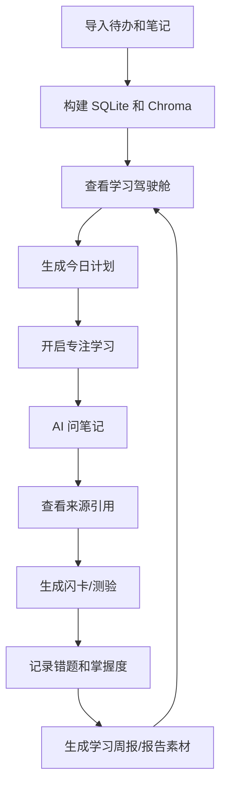
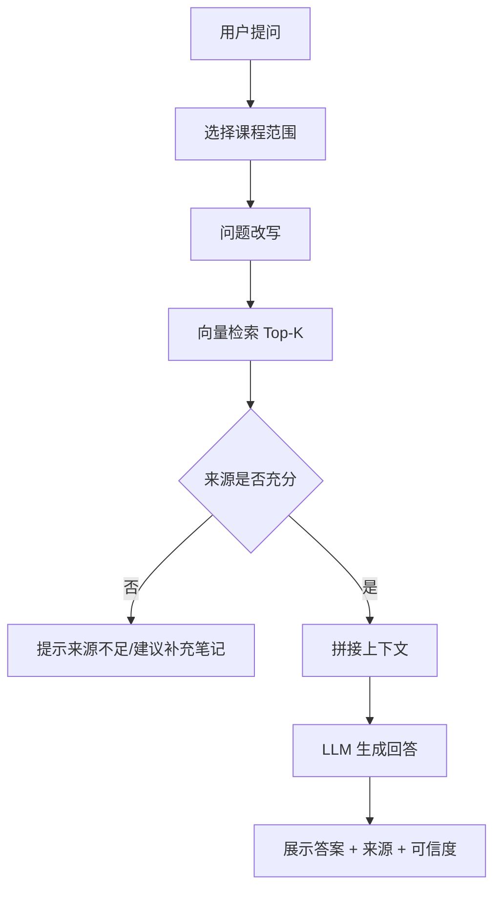
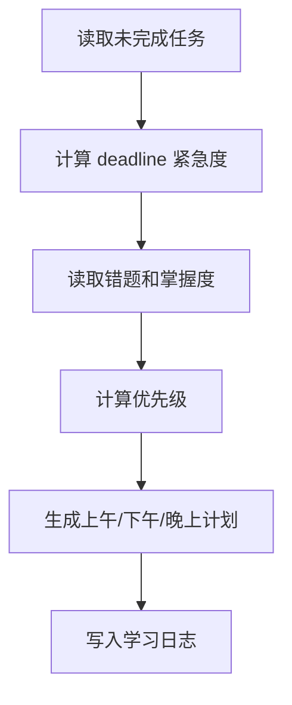
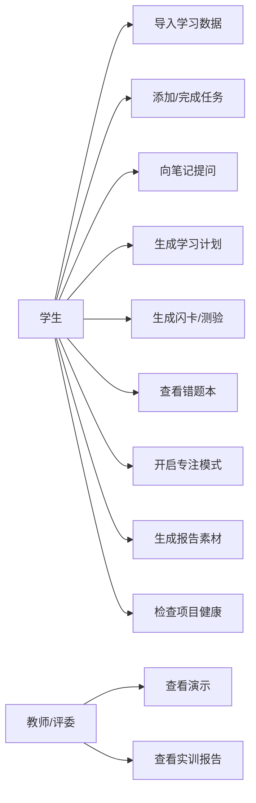
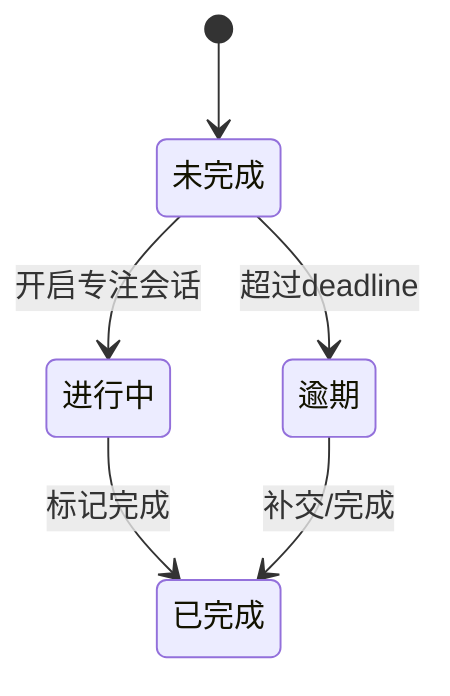
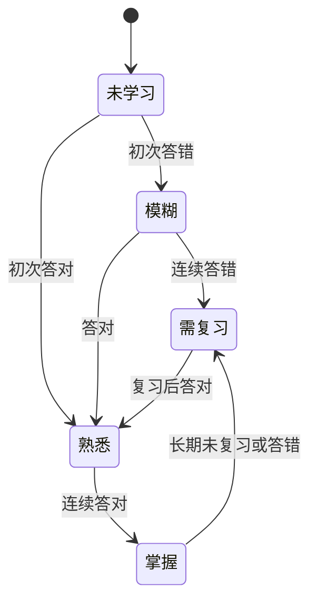

# StudyPilot 设计输出：线框图、业务流程图、用例图

## 1. 线框图

### 1.1 学习驾驶舱

```text
┌─────────────────────────────────────────────────────────────────────────────┐
│ StudyPilot 个人学习助手       搜索任务/笔记/知识点...       重建索引  设置     │
├───────────────┬───────────────────────────────────────────┬─────────────────┤
│ 学习驾驶舱     │ 上午好，今天建议先完成 Python 作业             │ AI 推荐下一步    │
│ AI 问笔记      │ ┌────────┬────────┬────────┬────────┐        │ 优先完成任务     │
│ 任务管理       │ │今日待办│已完成  │逾期    │待复习  │        │ 相关笔记         │
│ 复习训练       │ │  4     │  2     │  1     │  6     │        │ 快捷操作         │
│ 学习周报       │ └────────┴────────┴────────┴────────┘        │                 │
│ 资料库设置     │ ┌──────────────────────┬──────────────────┐ │                 │
│ Demo检查       │ │ 今日学习计划          │ 课程进度          │ │                 │
│               │ │ 09:00 Python作业      │ Python 70%       │ │                 │
│               │ │ 14:00 英语Unit5       │ 英语 50%         │ │                 │
│               │ │ 19:30 RAG复习         │ AI应用 80%       │ │                 │
│               │ └──────────────────────┴──────────────────┘ │                 │
└───────────────┴───────────────────────────────────────────┴─────────────────┘
```

### 1.2 AI 问笔记

```text
┌────────────资料源────────────┬────────────AI 问笔记────────────┬────────来源引用────────┐
│ 全部课程                      │ 用户：RAG 的流程是什么？          │ 高可信                 │
│ Python                        │ 助手：基于你的笔记，RAG 包含...   │ 1. AI应用/RAG流程      │
│ 英语                          │                                │ 相似度 0.86            │
│ AI应用开发                    │ [继续追问] [生成测验] [做闪卡]    │ 片段：先检索相关文档... │
│                              │ 输入问题... [发送]               │ 2. 向量库/Chroma       │
└──────────────────────────────┴────────────────────────────────┴───────────────────────┘
```

### 1.3 任务管理

```text
┌─────────────────────────────────────────────────────────────────────────────┐
│ 自然语言添加任务：周五前完成 Python 列表推导式作业              [解析并添加] │
├─────────────────────────────────────────────────────────────────────────────┤
│ 解析预览：course=Python | task=完成列表推导式作业 | deadline=周五 | 高优先级 │
├────────┬──────────┬────────────────────────┬────────────┬────────┬────────┤
│ ID     │ 课程      │ 任务                    │ 截止日期     │ 状态    │ 操作    │
│ 12     │ Python   │ 完成列表推导式作业        │ 周五         │ 未完成  │ 完成    │
└────────┴──────────┴────────────────────────┴────────────┴────────┴────────┘
```

### 1.4 复习训练

```text
┌────────设置────────┬───────────────────────────────────────────────────────┐
│ 课程：Python       │ Q1：列表推导式的基本语法是什么？                       │
│ 模式：闪卡/测验    │                                                       │
│ 数量：5            │ [显示答案]                                            │
│ [生成闪卡]         │                                                       │
│ [生成测验]         │ [掌握] [模糊] [不会]                                  │
├───────────────────┴───────────────────────────────────────────────────────┤
│ 错题本：列表推导式语法 - 来源：Python / 列表推导式                         │
└───────────────────────────────────────────────────────────────────────────┘
```

### 1.5 Demo 检查页

```text
┌──────────────────────────────项目健康检查──────────────────────────────────┐
│ SQLite 数据库       PASS                                                   │
│ Chroma 向量库        PASS                                                   │
│ API Key             WARN：未配置备用 Key                                    │
│ 演示数据             PASS：待办 12 条，笔记 15 条                            │
├──────────────────────────────截图检查清单──────────────────────────────────┤
│ [x] 学习驾驶舱  [x] AI问笔记  [ ] 复习训练  [ ] 学习周报  [x] 任务管理       │
└───────────────────────────────────────────────────────────────────────────┘
```

## 2. 业务流程图

### 2.1 学习闭环流程



### 2.2 RAG 问答流程



### 2.3 任务计划流程



## 3. 用例图



## 4. 状态流转图

### 4.1 任务状态



### 4.2 掌握度状态



